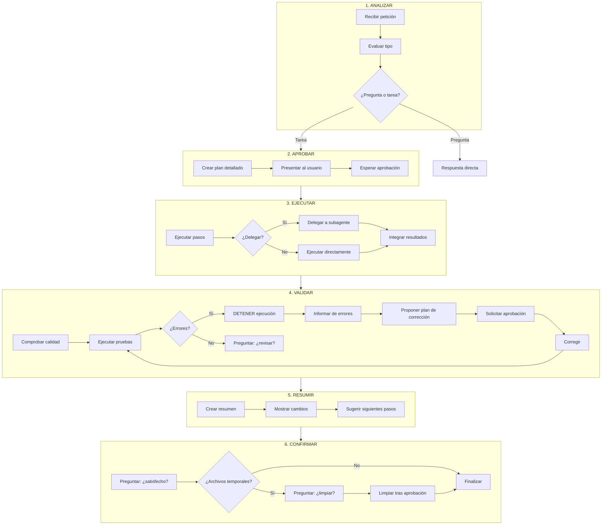
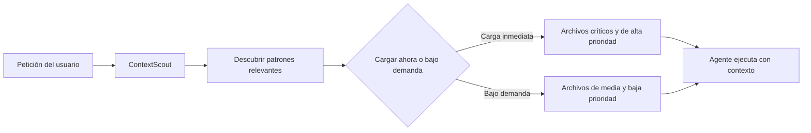

<!--
  Título: Guía de OpenAgentsControl (OAC)
  Propósito: Servir como referencia completa sobre el framework de agentes AI OpenAgentsControl, su arquitectura, instalación, flujo de trabajo y sistema de contexto.
  Creado: 2026-06-23
  Modificado: 2026-06-23
  Versión: 1.0
  Fuente: https://github.com/darrenhinde/OpenAgentsControl (v0.7.1)
  Clasificación: Referencia técnica / Guía de uso
-->

# Guía de OpenAgentsControl (OAC)

> OpenAgentsControl (OAC) es un framework de agentes AI construido sobre OpenCode que aprende tus patrones de código y genera código que coincide con ellos. Utiliza un modelo de ejecución basado en planes con aprobación humana obligatoria antes de cualquier acción.

---

## Índice

1. [Propósito del documento](#1-propósito-del-documento)
2. [¿Qué es OpenAgentsControl?](#2-qué-es-openagentscontrol)
3. [Instalación](#3-instalación)
4. [Arquitectura del sistema](#4-arquitectura-del-sistema)
5. [Agentes y subagentes](#5-agentes-y-subagentes)
6. [Flujo de trabajo (Workflow)](#6-flujo-de-trabajo-workflow)
7. [Comandos disponibles](#7-comandos-disponibles)
8. [Sistema de contexto (MVI)](#8-sistema-de-contexto-mvi)
9. [Cómo actualizar el contexto](#9-cómo-actualizar-el-contexto)
10. [Prompts tipo reutilizables](#10-prompts-tipo-reutilizables)
11. [Notas, errores conocidos y advertencias](#11-notas-errores-conocidos-y-advertencias)
12. [Glosario de términos y abreviaciones](#12-glosario-de-términos-y-abreviaciones)
13. [Referencias y enlaces útiles](#13-referencias-y-enlaces-útiles)

---

## 1. Propósito del documento

Este documento constituye una guía de referencia completa sobre OpenAgentsControl (OAC). Está dirigido a desarrolladores y profesionales técnicos que deseen comprender, instalar y utilizar este framework de agentes AI.

**Qué encontrará el lector aquí:**

- Explicación de la filosofía y arquitectura de OAC.
- Instrucciones detalladas de instalación y configuración.
- Descripción de cada agente, subagente y comando disponible.
- El flujo de trabajo completo de seis etapas.
- El sistema de contexto basado en MVI (Minimal Viable Information).
- Ejemplos de uso, advertencias y mejores prácticas.

**Quién debería leer este documento:**

- Desarrolladores que quieran integrar OAC en sus proyectos.
- Equipos que busquen estandarizar la generación de código con AI.
- Cualquier persona que desee comprender cómo funciona un sistema de agentes AI con compuertas de aprobación.

---

## 2. ¿Qué es OpenAgentsControl?

OpenAgentsControl (OAC) es un framework de código abierto para la creación y ejecución de agentes AI, construido sobre [OpenCode](https://opencode.ai). Fue creado por Darren Hinde y su repositorio principal se encuentra en [github.com/darrenhinde/OpenAgentsControl](https://github.com/darrenhinde/OpenAgentsControl).

### 2.1 Filosofía

La filosofía central de OAC se resume en una frase:

> **Tus patrones → El agente AI genera código que coincide.**

La mayoría de herramientas AI existentes producen código genérico que no se ajusta a los estándares del proyecto. El desarrollador debe refactorizar manualmente cada fragmento. OAC resuelve este problema enseñando al agente los patrones del proyecto *antes* de que genere código.

### 2.2 Principios fundamentales

| Principio | Descripción |
|-----------|-------------|
| **Aprobación humana obligatoria** | El agente propone un plan; el ser humano aprueba antes de ejecutar cualquier acción. |
| **Sin refactorización posterior** | El código generado coincide con los patrones del proyecto desde el primer momento. |
| **Eficiencia de tokens (MVI)** | Solo se carga la información mínima necesaria. Hasta un 80 % menos de tokens. |
| **Agentes editables** | Los agentes son archivos markdown que cualquier persona puede modificar sin compilación. |
| **Multi-lenguaje** | TypeScript, Python, Go, Rust, C# y cualquier lenguaje que use el proyecto. |
| **Multi-modelo** | Compatible con Claude, GPT, Gemini, MiniMax y modelos locales. Sin dependencia de proveedor. |

### 2.3 Datos del proyecto

| Dato | Valor |
|------|-------|
| Repositorio | [github.com/darrenhinde/OpenAgentsControl](https://github.com/darrenhinde/OpenAgentsControl) |
| Estrellas | ~4.358 |
| Versión actual | v0.7.1 |
| Licencia | MIT |
| Lenguaje principal | TypeScript |
| Framework base | OpenCode |

### 2.4 Comparativa con otras herramientas

| Característica | OpenAgentsControl | Cursor / Copilot | Aider | Oh My OpenCode |
|----------------|-------------------|------------------|-------|----------------|
| Aprende tus patrones | Sistema de contexto integrado | Sin aprendizaje de patrones | Sin aprendizaje de patrones | Configuración manual |
| Compuerta de aprobación | Siempre obligatoria | Opcional (desactivada por defecto) | Ejecución automática | Completamente autónomo |
| Eficiencia de tokens | Principio MVI (80 % menos) | Contexto completo cargado | Contexto completo cargado | Alto consumo de tokens |
| Estándares de equipo | Archivos de contexto compartidos | Configuración por usuario | Sin soporte de equipo | Configuración manual por usuario |
| Editar comportamiento del agente | Archivos markdown editables | Propietario / fijo | Prompts limitados | Archivos de configuración |
| Elección de modelo | Cualquier modelo, cualquier proveedor | Opciones limitadas | Solo OpenAI y Claude | Múltiples modelos |
| Velocidad de ejecución | Secuencial con aprobación | Rápida | Rápida | Agentes en paralelo |
| Recuperación de errores | Validación guiada por humano | Reintento automático (puede ciclar) | Reintento automático | Auto-corrección |
| Ideal para | Código en producción, equipos | Prototipos rápidos | Desarrolladores individuales | Usuarios avanzados, proyectos complejos |

---

## 3. Instalación

### 3.1 Prerrequisitos

- **OpenCode CLI**: la interfaz de línea de comandos de OpenCode (el instalador puede configurarla si no existe).
- **Bash 3.2 o superior**: presente en macOS y Linux por defecto. En Windows se recomienda Git Bash o WSL.
- **Git**: para control de versiones y para que el instalador descargue los componentes.

### 3.2 Comando de instalación

**Instalación recomendada (perfil developer):**

```bash
curl -fsSL https://raw.githubusercontent.com/darrenhinde/OpenAgentsControl/main/install.sh | bash -s developer
```

**Instalación interactiva (recomendada para quienes usan OAC por primera vez):**

```bash
curl -fsSL https://raw.githubusercontent.com/darrenhinde/OpenAgentsControl/main/install.sh -o install.sh
bash install.sh
```

El instalador interactivo guía al usuario a través de los siguientes pasos:

1. Elección de la ubicación de instalación (local, global o personalizada).
2. Elección del modo de instalación (rápida con perfil o personalizada).
3. Selección de componentes individuales (en modo personalizado).
4. Revisión y confirmación antes de proceder.

### 3.3 Perfiles de instalación

| Perfil | Descripción | Componentes incluidos |
|--------|-------------|-----------------------|
| `essential` | Mínimo necesario. | Agente OpenAgent, contextos esenciales, configuración básica. |
| `developer` | Herramientas de desarrollo. | OpenAgent, OpenCoder, task-manager, subagentes de código (reviewer, tester, coder-agent, build-agent), comandos de desarrollo (test, commit, context). |
| `business` | Herramientas de contenido y negocio. | Agentes de negocio, herramientas de creación de contenido, agentes de documentación. |
| `full` | Todo excepto SystemBuilder. | Todos los agentes, subagentes, comandos, herramientas y contextos. |
| `advanced` | Sistema completo. | Todo lo incluido en `full` más SystemBuilder y configuración avanzada. |

### 3.4 Actualización

Para actualizar una instalación existente:

```bash
curl -fsSL https://raw.githubusercontent.com/darrenhinde/OpenAgentsControl/main/update.sh | bash
```

Si la instalación se realizó en una ubicación personalizada, se debe indicar:

```bash
curl -fsSL https://raw.githubusercontent.com/darrenhinde/OpenAgentsControl/main/update.sh | bash -s -- --install-dir ~/.config/opencode
```

### 3.5 Ubicaciones de instalación

| Tipo | Ruta | Cuándo usarlo |
|------|------|---------------|
| Local (por defecto) | `.opencode/` en el directorio del proyecto | Agentes específicos del proyecto. Los patrones se guardan en el repositorio y se comparten con el equipo. |
| Global | `~/.config/opencode/` | Agentes disponibles para todos los proyectos. Útil para valores predeterminados personales. |
| Personalizada | Ruta indicada por el usuario | Estructuras organizativas personalizadas o instalaciones compartidas. |

> **NOTA**: La instalación local es la recomendada para equipos, ya que los patrones de contexto se guardan en el repositorio Git y todos los miembros del equipo los heredan automáticamente.

### 3.6 Plug-in para Claude Code (BETA)

OAC también está disponible como plug-in para Claude Code:

```bash
# Registrar el mercado
/plugin marketplace add darrenhinde/OpenAgentsControl

# Instalar el plug-in
/plugin install oac

# Descargar archivos de contexto
/oac:setup --core
```

---

## 4. Arquitectura del sistema

### 4.1 Estructura de directorios

```
.opencode/
├── agent/
│   ├── core/
│   │   ├── openagent.md          # Agente universal (preguntas, tareas generales)
│   │   └── opencoder.md          # Agente de desarrollo (código complejo)
│   ├── meta/
│   │   └── system-builder.md     # Generador de sistemas AI personalizados
│   └── subagents/                # Subagentes especializados
│       ├── context-scout.md
│       ├── external-scout.md
│       ├── task-manager.md
│       ├── coder-agent.md
│       ├── test-engineer.md
│       ├── code-reviewer.md
│       ├── build-agent.md
│       ├── doc-writer.md
│       └── ... (otros especialistas)
├── command/                      # Comandos slash (/)
│   ├── add-context.md
│   ├── context.md
│   ├── commit.md
│   ├── test.md
│   ├── optimize.md
│   ├── clean.md
│   ├── prompt-enchancer.md
│   ├── worktrees.md
│   └── validate-repo.md
├── context/                      # Sistema de contexto
│   ├── core/                     # Estándares y flujos de trabajo
│   │   ├── standards/
│   │   │   ├── code-quality.md
│   │   │   ├── test-coverage.md
│   │   │   ├── documentation.md
│   │   │   ├── security-patterns.md
│   │   │   └── code-analysis.md
│   │   └── workflows/
│   │       ├── code-review.md
│   │       ├── task-delegation-basics.md
│   │       ├── feature-breakdown.md
│   │       └── session-management.md
│   ├── development/              # Contextos de desarrollo
│   ├── ui/                       # Contextos de interfaz de usuario
│   ├── project-intelligence/     # Inteligencia del proyecto
│   │   ├── business-domain.md
│   │   ├── technical-domain.md
│   │   ├── business-tech-bridge.md
│   │   ├── decisions-log.md
│   │   └── living-notes.md
│   └── openagents-repo/          # Contexto del repositorio OAC
├── plugin/                       # Plug-ins opcionales
└── tool/                         # Herramientas opcionales

.tmp/sessions/                    # Sesiones temporales (contexto entre pasos)
```

### 4.2 Cómo se organiza el sistema

El sistema se compone de cuatro grandes bloques:

1. **Agentes** (`agent/`): trabajadores AI con capacidades específicas. Cada agente es un archivo markdown con metadatos (frontmatter), instrucciones y reglas.
2. **Comandos** (`command/`): puntos de entrada que cargan contexto y lo pasan a un agente. Se invocan con la barra inclinada (`/`).
3. **Contexto** (`context/`): conocimiento organizado en capas. Contiene los patrones, estándares y flujos de trabajo del proyecto.
4. **Sesiones** (`.tmp/sessions/`): espacios de trabajo temporales que preservan el contexto entre pasos de una tarea compleja.

### 4.3 Flujo de contexto

```
Petición del usuario
       ↓
    Comando slash (carga contexto con @)
       ↓
    ContextScout descubre patrones relevantes
       ↓
    Agente principal recibe contexto
       ↓
    Agente ejecuta o delega a subagentes
       ↓
    Subagentes reciben contexto del agente principal
       ↓
    Validación y resultados
```

---

## 5. Agentes y subagentes

### 5.1 Agentes principales

| Agente | Tipo | Propósito | Cuándo usarlo |
|--------|------|-----------|---------------|
| **OpenAgent** | Principal (universal) | Coordinador universal. Responde preguntas, ejecuta tareas generales, coordina flujos de trabajo. | Para empezar. Tareas generales, preguntas, implementaciones sencillas. |
| **OpenCoder** | Principal (desarrollo) | Desarrollo complejo multi-archivo. Refactorización, sistemas de producción. | Características complejas, refactorización profunda, análisis de arquitectura. |
| **SystemBuilder** | Principal (meta) | Genera sistemas AI personalizados completos mediante un asistente interactivo. | Cuando se necesita crear un sistema AI específico para un dominio. |

### 5.2 Subagentes especializados

| Subagente | Propósito | Delegado automáticamente por |
|-----------|-----------|------------------------------|
| **ContextScout** | Descubre patrones de contexto relevantes antes de generar código. Los clasifica por prioridad (crítico, alta, media). | OpenAgent, OpenCoder |
| **ExternalScout** | Obtiene documentación actualizada de librerías externas desde fuentes oficiales (npm, GitHub, sitios de documentación). | OpenAgent, OpenCoder |
| **TaskManager** | Desglosa características complejas en subtareas atómicas y verificables. | OpenAgent (cuando hay 4+ archivos o dependencias complejas) |
| **CoderAgent** | Implementa subtareas de código de forma centrada y específica. | TaskManager, OpenCoder |
| **TestEngineer** | Crea y ejecuta pruebas. Sigue TDD cuando se le solicita. | OpenCoder |
| **CodeReviewer** | Revisa calidad del código, seguridad y buenas prácticas. | OpenCoder |
| **BuildAgent** | Ejecuta comprobaciones de tipos (type-check) y validación de compilación. | OpenCoder |
| **DocWriter** | Genera y actualiza documentación técnica. | OpenAgent (cuando se solicitan documentos) |
| **ContextOrganizer** | Organiza y mantiene los archivos de contexto del proyecto. | ContextScout |
| **Image Specialist** | Genera imágenes y diagramas (requiere Gemini AI). | OpenAgent |
| **Frontend Specialist** | Desarrollo de interfaz de usuario frontend. Sigue un flujo de 4 etapas (maqueta, tema, animación, implementación). | OpenCoder |
| **DevOps Specialist** | Configuración de CI/CD e infraestructura. | OpenCoder |

### 5.3 Criterios de delegación

OpenAgent decide delegar según estas reglas:

| Situación | Acción |
|-----------|--------|
| Pregunta informativa | Responde directamente. |
| Tarea sencilla (1-3 archivos) | Ejecuta directamente. |
| Característica compleja (4+ archivos) | Delega a TaskManager. |
| Documentación completa o multi-página | Delega a DocWriter. |
| Se necesita perspectiva alternativa | Delega a un agente general. |
| Tarea especializada de código | Delega a los especialistas de código (tester, reviewer, build). |

---

## 6. Flujo de trabajo (Workflow)

OAC sigue un flujo de trabajo de seis etapas, obligatorio para cualquier tarea que requiera ejecución.

### 6.1 Diagrama general del flujo



### 6.2 Descripción de cada etapa

#### Etapa 1: Analizar

El agente recibe la petición del usuario y determina si es una pregunta informativa o una tarea que requiere ejecución.

- **Si es pregunta**: responde directamente sin necesidad de aprobación.
- **Si es tarea**: evalúa la complejidad, identifica los recursos necesarios y pasa a la etapa 2.

#### Etapa 2: Aprobar (REGLAS CRÍTICAS)

El agente crea un plan detallado paso a paso y lo presenta al usuario.

**REGLA CRÍTICA**: el agente **SIEMPRE** debe solicitar aprobación antes de cualquier ejecución (escribir archivos, editar, ejecutar comandos, delegar tareas). Esta regla es absoluta y estricta.

**Ejemplo de plan presentado al usuario:**

```
## Plan propuesto
1. Crear archivo README.md
2. Añadir sección de visión general del proyecto
3. Añadir instrucciones de instalación
4. Añadir ejemplos de uso

**Se necesita aprobación antes de proceder.**
```

El usuario puede: aprobar, solicitar cambios o cancelar.

#### Etapa 3: Ejecutar

El agente lleva a cabo el plan aprobado. Puede hacerlo de dos formas:

- **Directa**: el agente principal ejecuta los pasos por sí mismo.
- **Delegada**: el agente principal delega en subagentes especializados (TaskManager, CoderAgent, etc.) y luego integra los resultados.

Si la tarea es compleja, el agente crea una sesión temporal en `.tmp/sessions/` para preservar el contexto entre pasos.

#### Etapa 4: Validar (REGLAS CRÍTICAS)

El agente comprueba la calidad del trabajo ejecutado.

**Reglas críticas en esta etapa:**

1. **DETENER en caso de error**: si las pruebas fallan, la ejecución se detiene inmediatamente.
2. **INFORMAR primero**: siempre se deben comunicar los errores antes de proponer correcciones.
3. **NO corregir automáticamente**: el agente nunca aplica correcciones sin aprobación explícita.

**Flujo de validación con errores:**

```
1. Se ejecutan las pruebas.
2. Si fallan → se DETIENE la ejecución.
3. Se INFORMA de todos los errores de forma clara.
4. Se PROPONE un plan de corrección.
5. Se SOLICITA aprobación antes de corregir.
6. Tras la aprobación, se aplican las correcciones.
7. Se vuelven a ejecutar las pruebas (volver al paso 1).
```

#### Etapa 5: Resumir

Una vez validado, el agente presenta un resumen de los cambios realizados y sugiere los siguientes pasos.

**Ejemplo de resumen:**

```
## Resumen
Se ha creado el archivo README.md con la documentación del proyecto.

**Cambios realizados:**
- Creado README.md
- Añadida visión general del proyecto
- Añadida guía de instalación
- Añadidos ejemplos de uso

**Siguientes pasos:** Revisar el README y actualizarlo según sea necesario.
```

#### Etapa 6: Confirmar

El agente pregunta al usuario si está satisfecho con el resultado.

**REGLA CRÍTICA**: el agente **SIEMPRE** debe confirmar antes de eliminar archivos de sesión temporales. Esta regla es absoluta y estricta.

```
¿Está completo y es satisfactorio?
¿Debo limpiar los archivos temporales de sesión en .tmp/sessions/20250118-143022-a4f2/?
```

---

## 7. Comandos disponibles

### 7.1 Tabla de comandos

| Comando | Descripción | Ejemplo de uso |
|---------|-------------|----------------|
| `/add-context` | Asistente interactivo para añadir patrones de contexto. Hace 6 preguntas sobre el proyecto. | `/add-context` |
| `/add-context --update` | Actualiza el contexto existente cuando cambian los patrones. Incrementa la versión. | `/add-context --update` |
| `/context` | Gestión avanzada de contexto. Incluye subcomandos. | `/context validate` |
| `/commit` | Commits inteligentes con formato convencional. | `/commit "feat: añadir autenticación de usuarios"` |
| `/test` | Flujos de trabajo de pruebas. | `/test` |
| `/optimize` | Optimización de código. | `/optimize` |
| `/clean` | Limpieza de archivos temporales y sesiones. | `/clean` |
| `/prompt-enchancer` | Crea agentes complejos con flujos de trabajo. | `/prompt-enchancer "Crea un agente que..."` |
| `/worktrees` | Gestión de Git worktrees. | `/worktrees` |
| `/validate-repo` | Valida la consistencia del repositorio. | `/validate-repo` |

### 7.2 Subcomandos de `/context`

| Subcomando | Función |
|------------|---------|
| `/context harvest` | Recolecta patrones del código existente. |
| `/context extract` | Extrae fragmentos de contexto relevantes. |
| `/context organize` | Organiza los archivos de contexto. |
| `/context update` | Actualiza contexto existente. |
| `/context map` | Genera un mapa visual del contexto. |
| `/context validate` | Valida la consistencia del contexto. |
| `/context compact` | Compacta archivos de contexto para eficiencia. |

### 7.3 Funcionamiento del comando `/add-context`

El comando `/add-context` guía al usuario a través de seis preguntas para capturar los patrones del proyecto:

1. **Pila tecnológica**: ¿Qué tecnologías usa el proyecto? (ej: Next.js + TypeScript + PostgreSQL + Tailwind)
2. **Ejemplo de endpoint API**: el usuario pega un ejemplo de su código real.
3. **Ejemplo de componente**: el usuario pega un ejemplo de componente real.
4. **Convenciones de nomenclatura**: ¿qué convenciones se usan? (kebab-case, PascalCase, camelCase)
5. **Estándares de código**: ¿qué reglas de calidad se aplican? (TypeScript strict, validación Zod, etc.)
6. **Requisitos de seguridad**: ¿qué medidas de seguridad son obligatorias? (validar entrada, consultas parametrizadas, etc.)

---

## 8. Sistema de contexto (MVI)

### 8.1 Principio MVI (Minimal Viable Information)

MVI significa **Minimal Viable Information** (Información Mínima Viable). Es el principio fundamental que rige el sistema de contexto de OAC.

**Idea central:** solo se carga la información relevante para la tarea actual, en el momento en que se necesita. No se carga el contexto completo del proyecto.

**Beneficios:**

- Hasta un 80 % menos de tokens consumidos.
- Respuestas más rápidas.
- Código que coincide con los patrones del proyecto desde el primer momento.

### 8.2 Comparativa: enfoque tradicional vs. MVI

| Aspecto | Enfoque tradicional | OAC con MVI |
|---------|---------------------|-------------|
| Contexto cargado | Todo el código base | Solo patrones relevantes |
| Tamaño de archivos | Grandes (miles de líneas) | Pequeños (menos de 200 líneas) |
| Carga | Todo al inicio | Bajo demanda (lazy loading) |
| Tokens por petición | ~8.000 | ~750 (reducción del 80 %) |
| Velocidad de respuesta | Lenta | Rápida |
| Calidad del código | Genérico (requiere refactorización) | Coincide con los patrones del proyecto |

### 8.3 Estructura del contexto

```
.opencode/context/
├── core/                          # Contexto esencial (siempre disponible)
│   ├── standards/                 # Estándares de calidad
│   │   ├── code-quality.md        # Patrones de código
│   │   ├── test-coverage.md       # Cobertura de pruebas
│   │   ├── documentation.md       # Estándares de documentación
│   │   ├── security-patterns.md   # Patrones de seguridad
│   │   └── code-analysis.md       # Análisis de código
│   └── workflows/                 # Flujos de trabajo
│       ├── code-review.md
│       ├── task-delegation-basics.md
│       ├── feature-breakdown.md
│       └── session-management.md
├── development/                   # Contexto de desarrollo
├── ui/                            # Contexto de interfaz de usuario
├── project-intelligence/          # Inteligencia del proyecto
│   ├── business-domain.md         # Dominio del negocio
│   ├── technical-domain.md        # Dominio técnico
│   ├── business-tech-bridge.md    # Puente negocio-técnica
│   ├── decisions-log.md           # Registro de decisiones
│   └── living-notes.md            # Notas vivas del proyecto
└── openagents-repo/               # Contexto del repositorio OAC
```

### 8.4 Carga bajo demanda (lazy loading)

El sistema de contexto no carga todos los archivos al inicio. En su lugar:

1. **ContextScout** descubre qué archivos de contexto son relevantes para la tarea actual.
2. Los clasifica por prioridad: crítico, alta, media.
3. El agente principal carga solo los archivos necesarios.
4. Si durante la ejecución se necesita más contexto, se carga bajo demanda.



### 8.5 Límites de tamaño de archivos de contexto

| Tipo de archivo | Límite recomendado |
|-----------------|-------------------|
| Concepto | Menos de 100 líneas |
| Guía | Menos de 150 líneas |
| Ejemplo | Menos de 80 líneas |
| Máximo absoluto | Menos de 200 líneas |

### 8.6 Resolución de contexto (local vs. global)

ContextScout sigue un orden de resolución local primero:

```
1. Comprobar en local: .opencode/context/core/navigation.md
   ¿Encontrado? → Usar local. Fin.
   ¿No encontrado?
2. Comprobar en global: ~/.config/opencode/context/core/navigation.md
   ¿Encontrado? → Usar global solo para archivos core/.
   ¿No encontrado? → Continuar sin contexto core.
```

**Reglas clave:**

- **Lo local siempre prevalece**: si hay instalación local, no se consulta la global.
- **La global solo aplica a `core/`**: archivos universales que son iguales en todos los proyectos.
- **La inteligencia del proyecto es siempre local**: los patrones, la pila tecnológica y las convenciones viven en `.opencode/context/project-intelligence/` y nunca se cargan desde la global.
- **La comprobación se hace una sola vez**: ContextScout resuelve la ubicación al inicio (máximo 2 comprobaciones glob).

---

## 9. Cómo actualizar el contexto

El contexto del proyecto evoluciona con el tiempo. Existen cuatro métodos para mantenerlo actualizado.

### 9.1 Método 1: `/add-context` (asistente interactivo)

El comando `/add-context` guía al usuario a través de seis preguntas para añadir patrones nuevos.

```bash
/add-context
```

**Cuándo usarlo:** cuando se añade un nuevo proyecto, una nueva pila tecnológica o un conjunto de patrones completamente nuevo.

### 9.2 Método 2: `/add-context --update` (actualización)

Cuando los patrones existentes cambian, se utiliza la opción `--update`.

```bash
/add-context --update
```

**Qué hace:**
- Actualiza la pila tecnológica, los patrones y los estándares.
- Incrementa la versión del contexto (ej: 1.0 → 1.1).
- Actualiza la fecha de modificación.

**Cuándo usarlo:** cuando se añade una nueva librería, cambian los patrones del proyecto o se migra la pila tecnológica.

### 9.3 Método 3: `/context` (gestión avanzada)

Los subcomandos de `/context` ofrecen control granular sobre el contexto.

```bash
# Validar la consistencia del contexto
/context validate

# Recolectar patrones del código existente
/context harvest

# Organizar archivos de contexto
/context organize

# Compactar archivos para eficiencia
/context compact

# Generar mapa visual del contexto
/context map
```

### 9.4 Método 4: Edición manual directa

Los archivos de contexto son markdown. Se pueden editar directamente con cualquier editor de texto.

```bash
nano .opencode/context/project-intelligence/technical-domain.md
```

**Ventaja:** no hay compilación ni proceso intermedio. Se edita y ya está disponible.

**Advertencia:** al editar manualmente, hay que mantener la estructura y el formato del archivo para que ContextScout pueda interpretarlo correctamente.

### 9.5 Flujo recomendado para mantener el contexto actualizado

```mermaid
graph LR
    A[ContextScout descubre] --> B[Analizar qué falta o está desactualizado]
    B --> C[/add-context --update]
    C --> D[/context validate]
    D --> E{¿Válido?}
    E -->|Sí| F[/commit "Actualizar contexto del proyecto"]
    E -->|No| G[Editar manualmente o re-ejecutar /add-context]
    G --> D
```

---

## 10. Prompts tipo reutilizables

### 10.1 Prompt para actualizar todo el contexto

```
/add-context --update

Quiero actualizar el contexto de este proyecto. Hemos añadido las siguientes
novedades:
- Nueva librería: Stripe para pagos
- Nuevo patrón: validación con Zod en todos los endpoints
- Nueva convención: nombres de archivos en kebab-case
- Nuevo requisito de seguridad: todas las consultas deben ser parametrizadas
```

### 10.2 Prompt para añadir un nuevo patrón

```
Quiero añadir un nuevo patrón al contexto del proyecto.

Patrón: manejo de errores centralizado
Descripción: todas las funciones asíncronas deben usar un wrapper try/catch
que llame a un servicio central de errores.

Código de ejemplo:
export async function apiHandler<T>(fn: () => Promise<T>): Promise<T> {
  try {
    return await fn();
  } catch (error) {
    return ErrorService.handle(error);
  }
}
```

### 10.3 Prompt para investigar una librería externa

```
Quiero utilizar la librería "zustand" para manejo de estado en React.
Necesito:
1. Documentación actualizada de zustand (usar ExternalScout).
2. Ejemplos de uso con TypeScript.
3. Patrones recomendados para proyectos grandes.
4. Comparativa con otras soluciones de estado (Redux, Jotai).
```

### 10.4 Prompt para desglose de características

```
Necesito implementar un sistema de autenticación de usuarios completo.

Por favor:
1. Analiza los requisitos y desglosa en subtareas (usar TaskManager).
2. Cada subtarea debe tener criterios de validación.
3. Identifica dependencias entre subtareas.
4. Sugiere el orden óptimo de implementación.

Requisitos:
- Registro de usuarios con email y contraseña.
- Inicio de sesión con JWT.
- Recuperación de contraseña.
- Middleware de autenticación para rutas protegidas.
- Panel de perfil de usuario.
```

### 10.5 Prompt para iniciar un proyecto nuevo con OAC

```
/add-context

Voy a empezar un nuevo proyecto. Por favor, guíame a través de las
6 preguntas para configurar el contexto.

Pila tecnológica planificada:
- Next.js 14 con App Router
- TypeScript en modo estricto
- PostgreSQL con Drizzle ORM
- Tailwind CSS para estilos
- Zod para validación
- NextAuth para autenticación
```

---

## 11. Notas, errores conocidos y advertencias

### 11.1 Advertencias críticas

> **⚠️ OAC NO es autónomo.** El framework requiere aprobación humana en cada paso. No ejecuta nada sin autorización explícita. No está diseñado para funcionar sin supervisión.

> **⚠️ Sin contexto, el agente genera código genérico.** Si no se han añadido patrones de contexto, el código generado no se ajustará a los estándares del proyecto y requerirá refactorización manual. La primera configuración de contexto lleva entre 10 y 15 minutos.

> **⚠️ No usar abreviaciones en los prompts que se leen desde reglas.** Los archivos de contexto y las reglas de los agentes deben usar palabras completas para evitar interpretaciones incorrectas por parte del modelo de lenguaje.

> **⚠️ Los archivos de contexto se editan en markdown, sin compilación.** Esto es una ventaja (no hay proceso intermedio), pero también implica que no hay validación automática del formato. Es necesario mantener la estructura manualmente.

### 11.2 Errores conocidos

| Error | Síntoma | Solución |
|-------|---------|----------|
| Contexto no encontrado | El agente genera código genérico | Ejecutar `/add-context` para configurar los patrones del proyecto. |
| Colisión de archivos al instalar | El instalador detecta archivos existentes | Usar la opción 3 (Backup & Overwrite) del instalador. Se crea una copia de seguridad antes de sobrescribir. |
| Sesiones temporales acumuladas | El directorio `.tmp/sessions/` contiene muchas carpetas | Ejecutar el script de limpieza: `./scripts/maintenance/cleanup-stale-sessions.sh` o usar `/clean`. |
| Modelo no disponible | El agente no responde o da errores de API | Verificar la configuración del modelo en el frontmatter del agente y comprobar que la API key sigue siendo válida. |
| Contexto desactualizado | El código generado usa patrones antiguos | Ejecutar `/add-context --update` para actualizar los patrones. |

### 11.3 Mejores prácticas

| Práctica | Descripción |
|----------|-------------|
| **Configurar el contexto al empezar** | Dedicar 10-15 minutos iniciales a configurar el contexto con `/add-context`. Esto evita refactorización posterior. |
| **Usar ExternalScout con librerías externas** | Siempre que se utilice una librería externa, ExternalScout obtiene la documentación actualizada y evita el uso de datos de entrenamiento obsoletos. |
| **Revisar los planes antes de aprobar** | Cada plan propuesto por el agente debe revisarse cuidadosamente antes de dar la aprobación. Se puede solicitar al agente que revise el plan si algo no está claro. |
| **Actualizar el contexto periódicamente** | Cuando el proyecto cambie (nueva librería, nuevo patrón, migración), ejecutar `/add-context --update`. |
| **Guardar el contexto en el repositorio** | El directorio `.opencode/context/project-intelligence/` debe estar versionado en Git para que todo el equipo herede los patrones. |
| **Usar palabras completas en los prompts de reglas** | No abreviar términos en los archivos de contexto o en las reglas de los agentes. La claridad es esencial para que el modelo interprete correctamente las instrucciones. |

### 11.4 Ventajas clave de OAC

| Ventaja | Descripción |
|---------|-------------|
| **Eficiencia MVI** | Hasta un 80 % menos de tokens en comparación con cargar todo el código base. |
| **Agentes editables** | Los agentes son archivos markdown que cualquier persona puede modificar sin necesidad de compilar ni reiniciar nada. |
| **Multi-modelo** | Cambiar de modelo editando el frontmatter del agente. Sin dependencia de proveedor. |
| **Contexto versionado** | El contexto se guarda en Git, lo que permite rastrear cambios y volver a versiones anteriores. |
| **Estándares de equipo** | Un solo archivo de contexto define los patrones para todo el equipo. Los nuevos desarrolladores heredan los estándares el primer día. |

---

## 12. Glosario de términos y abreviaciones

| Término | Definición |
|---------|------------|
| **Agente** | Archivo markdown que define un trabajador AI con instrucciones, reglas y metadatos. |
| **Approval Gate** | Compuerta de aprobación. Regla crítica que obliga al agente a solicitar aprobación humana antes de ejecutar cualquier acción. |
| **Claude Code** | Herramienta de codificación AI de Anthropic. OAC está disponible como plug-in para Claude Code (en beta). |
| **Comando slash** | Comando que comienza con `/` (ej: `/add-context`, `/commit`). Punto de entrada que carga contexto y lo pasa a un agente. |
| **Context bundle** | Paquete de contexto que se pasa a un subagente cuando el agente principal delega una tarea. |
| **ContextScout** | Subagente especializado que descubre qué archivos de contexto son relevantes para la tarea actual. |
| **ExternalScout** | Subagente que obtiene documentación actualizada de librerías externas desde fuentes oficiales. |
| **Frontmatter** | Metadatos en formato YAML al inicio de los archivos markdown de los agentes. Contiene descripción, modelo, herramientas y permisos. |
| **Framework** | Conjunto de herramientas, convenciones y patrones que estructuran el desarrollo de software. |
| **Lazy loading** | Carga bajo demanda. Los archivos de contexto solo se cargan cuando son necesarios, no al inicio. |
| **MVI** | Minimal Viable Information. Principio de diseño que carga solo la información mínima necesaria para cada tarea. |
| **OAC** | OpenAgentsControl. Framework de agentes AI objeto de esta guía. |
| **OpenCode** | Framework de código abierto para agentes AI de codificación. OAC se construye sobre OpenCode. |
| **OpenAgent** | Agente principal universal de OAC. Responde preguntas, ejecuta tareas generales y coordina flujos de trabajo. |
| **OpenCoder** | Agente principal de desarrollo. Maneja código complejo, refactorización multi-archivo y sistemas de producción. |
| **Plan-first** | Modelo de ejecución que primero crea un plan detallado y luego solicita aprobación antes de ejecutar. |
| **Prompt** | Instrucción de texto que se envía al modelo de lenguaje para guiar su respuesta. |
| **Sesión** | Espacio de trabajo temporal en `.tmp/sessions/` que preserva el contexto entre pasos de una tarea compleja. |
| **Slash command** | Ver "Comando slash". |
| **Subagente** | Agente especializado enfocado en una tarea concreta (pruebas, revisión, documentación, etc.). |
| **SystemBuilder** | Agente meta que genera sistemas AI personalizados completos mediante un asistente interactivo. |
| **System prompt** | Conjunto de instrucciones que definen el comportamiento base de un agente. Se encuentra en el archivo markdown del agente. |
| **TaskManager** | Subagente que desglosa características complejas en subtareas atómicas y verificables. |
| **TDD** | Test-Driven Development. Metodología de desarrollo que escribe las pruebas antes del código de producción. |

---

## 13. Referencias y enlaces útiles

### 13.1 Repositorios

| Recurso | Enlace |
|---------|--------|
| Repositorio principal de OAC | [github.com/darrenhinde/OpenAgentsControl](https://github.com/darrenhinde/OpenAgentsControl) |
| Documentación de OAC | [github.com/darrenhinde/OpenAgentsControl/tree/main/docs](https://github.com/darrenhinde/OpenAgentsControl/tree/main/docs) |
| OpenCode (framework base) | [github.com/anomalyco/opencode](https://github.com/anomalyco/opencode) |
| Oh My OpenCode | [github.com/yeon-gyu/oh-my-opencode](https://github.com/yeon-gyu/oh-my-opencode) |

### 13.2 Sitios web

| Recurso | Enlace |
|---------|--------|
| OpenCode (sitio oficial) | [opencode.ai](https://opencode.ai) |
| Documentación de OpenCode | [opencode.ai/docs](https://opencode.ai/docs) |
| Models.dev (modelos disponibles) | [models.dev](https://models.dev) |

### 13.3 Comunidad

| Recurso | Enlace |
|---------|--------|
| Creador del proyecto (X/Twitter) | [@DarrenBuildsAI](https://x.com/DarrenBuildsAI) |
| Canal de YouTube | [youtube.com/@DarrenBuildsAI](https://youtube.com/@DarrenBuildsAI) |
| Comunidad NextSystems | [nextsystems.ai](https://nextsystems.ai) |
| Discusiones del proyecto | [github.com/darrenhinde/OpenAgentsControl/discussions](https://github.com/darrenhinde/OpenAgentsControl/discussions) |

### 13.4 Recursos adicionales

| Recurso | Enlace |
|---------|--------|
| Guía de contribución de OAC | [CONTRIBUTING.md](https://github.com/darrenhinde/OpenAgentsControl/blob/main/docs/contributing/CONTRIBUTING.md) |
| Código de conducta de OAC | [CODE_OF_CONDUCT.md](https://github.com/darrenhinde/OpenAgentsControl/blob/main/docs/contributing/CODE_OF_CONDUCT.md) |
| Registro de cambios de OAC | [CHANGELOG.md](https://github.com/darrenhinde/OpenAgentsControl/blob/main/CHANGELOG.md) |
| Plug-in OAC para Claude Code | [plugins/claude-code/README.md](https://github.com/darrenhinde/OpenAgentsControl/blob/main/plugins/claude-code/README.md) |

---

<!-- Fin del documento -->
