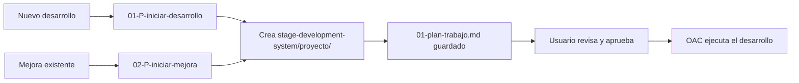
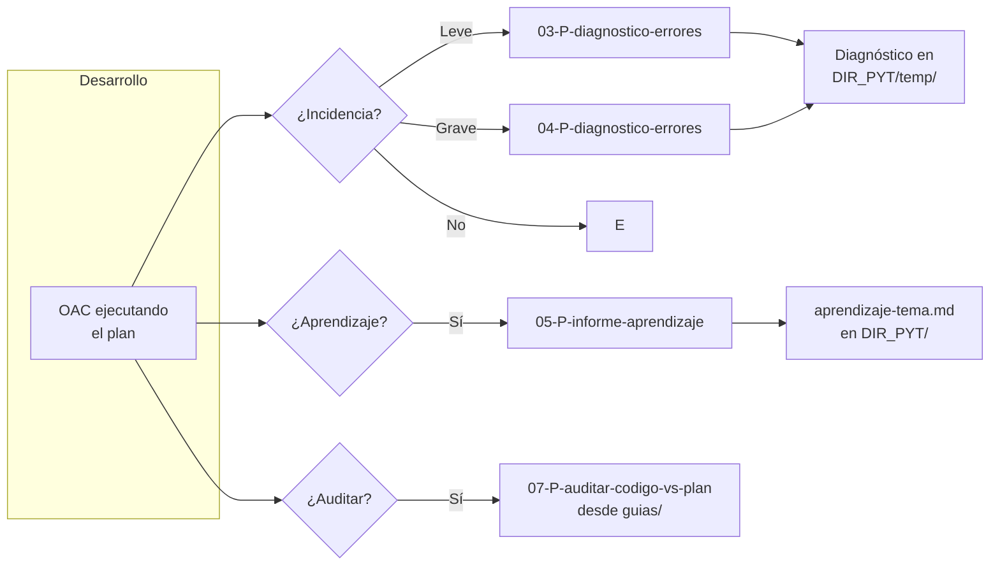
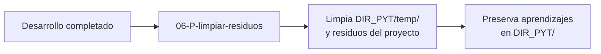
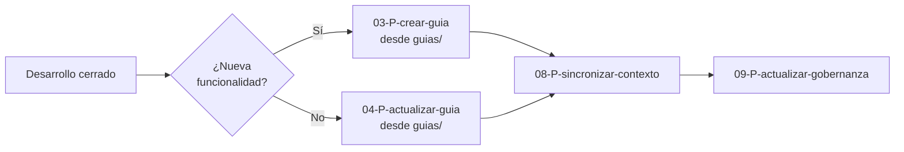
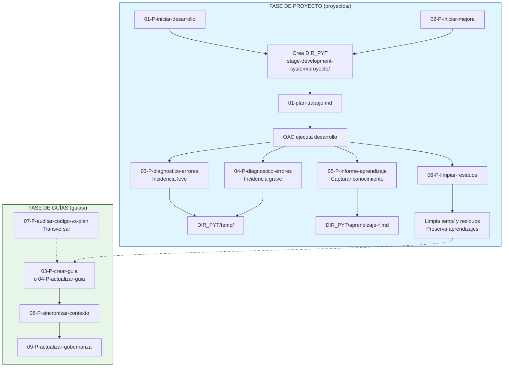

# Flujo de trabajo — Sistema de Proyectos y Guías

> **Propósito:** Explicar el proceso completo de trabajo con el sistema de prompts de `proyectos/` y `guias/`: cómo iniciar un desarrollo, diagnosticar incidencias, capturar aprendizaje, auditar, documentar y limpiar.
> **Última actualización:** 2026-06-12

---

## Índice

1. [Visión general del sistema](#1-visión-general-del-sistema)
2. [Guía rápida: flujo completo](#2-guía-rápida-flujo-completo)
   - [Inicio del proyecto](#inicio-del-proyecto)
   - [Durante el desarrollo](#durante-el-desarrollo)
   - [Cierre del proyecto](#cierre-del-proyecto)
   - [Documentación y guías](#documentación-y-guías)
3. [Mapa completo del sistema](#3-mapa-completo-del-sistema)
4. [Referencia rápida de prompts](#4-referencia-rápida-de-prompts)
   - [Prompts de proyecto (proyectos/)](#prompts-de-proyecto-proyectos)
   - [Prompts de guías (guias/)](#prompts-de-guías-guias)
5. [Estructura del DIR_PYT](#5-estructura-del-dir_pyt)
6. [Ejemplo de sesión completa](#6-ejemplo-de-sesión-completa)

---

<a id="1-visión-general-del-sistema"></a>
# 1. Visión general del sistema

El sistema se divide en dos grupos de prompts que trabajan juntos:

```
stage-management-system/prompts/
├── proyectos/       ← 6 prompts para el día a día del desarrollo
│   ├── 01, 02      → Diagnóstico de errores
│   ├── 03          → Limpieza de residuos
│   ├── 04          → Capturar aprendizaje
│   ├── 05          → Iniciar nuevo desarrollo
│   └── 06          → Iniciar mejora/revisión
│
└── guias/           ← 7 prompts para documentación permanente
    ├── 01          → Mapa visual del flujo
    ├── 03          → Crear guía técnica
    ├── 04          → Actualizar guía existente
    ├── 05          → Inventario de áreas a documentar
    ├── 06          → Auditar directorio
    ├── 07          → Auditar código vs plan
    ├── 08          → Sincronizar .opencode/context/
    └── 09          → Sincronizar .gobernanza/
```

**Cada desarrollo genera un DIR_PYT** en `stage-development-system/[proyecto]/` que agrupa todos los archivos de trabajo: plan, diagnósticos, aprendizajes, informes.

---

<a id="2-guía-rápida-flujo-completo"></a>
# 2. Guía rápida: flujo completo

<a id="inicio-del-proyecto"></a>
## Inicio del proyecto

Cuando empiezas algo nuevo (funcionalidad, mejora, revisión de pendientes):



<a id="durante-el-desarrollo"></a>
## Durante el desarrollo

Mientras trabajas, pueden surgir incidencias o puedes querer capturar conocimiento:



<a id="cierre-del-proyecto"></a>
## Cierre del proyecto

Al finalizar el desarrollo, antes de documentar:



<a id="documentación-y-guías"></a>
## Documentación y guías

Después del cierre, documentar lo realizado:



---

<a id="3-mapa-completo-del-sistema"></a>
# 3. Mapa completo del sistema



---

<a id="4-referencia-rápida-de-prompts"></a>
# 4. Referencia rápida de prompts

<a id="prompts-de-proyecto-proyectos"></a>
## Prompts de proyecto (`proyectos/`)

| # | Prompt | Cuándo | Entrada | Salida |
|:-:|--------|--------|---------|--------|
| 01 | `03-P-diagnostico-errores.md` | Incidencia leve (rápida) | Síntoma + contexto | Diagnóstico breve + checklist |
| 02 | `04-P-diagnostico-errores.md` | Incidencia grave/compleja | Síntoma + logs | Diagnóstico profundo + plan de trabajo |
| 03 | `06-P-limpiar-residuos.md` | Al finalizar desarrollo | *(ninguna)* | Limpieza de residuos + reporte |
| 04 | `05-P-informe-aprendizaje.md` | Al resolver un tema concreto | Tema resuelto | `aprendizaje-[tema].md` en DIR_PYT |
| 05 | `01-P-iniciar-desarrollo.md` | Nuevo desarrollo | Descripción del desarrollo | `stage-development-system/[proyecto]/` + `01-plan-trabajo.md` |
| 06 | `02-P-iniciar-mejora.md` | Mejora/revisión existente | Área + motivo | `01-plan-trabajo.md` (o reusa DIR_PYT) |

### Campos opcionales comunes (proyectos/)

| Campo | Aplica a | Valores |
|-------|:--------:|---------|
| `DIR_PYT` (se deduce) | 01, 02, 03, 04 | `stage-development-system/[proyecto]/` |
| `Tema` | 04 | Nombre del tema resuelto (kebab-case) |

<a id="prompts-de-guías-guias"></a>
## Prompts de guías (`guias/`)

| # | Prompt | Cuándo | Entrada | Salida |
|:-:|--------|--------|---------|--------|
| 01 | `01-flujo-trabajo-uso-rapido.md` | Para entender el sistema | *(lectura)* | Mapa visual + contenido ampliado |
| 03 | `03-P-crear-guia.md` | Funcionalidad nueva terminada | Descripción del área | 3 docs en `conocimiento-guias-ia/` |
| 04 | `04-P-actualizar-guia.md` | Mejora de funcionalidad existente | Área + cambios | 3 docs actualizados |
| 05 | `05-P-tematicas-guia.md` | Inventario de áreas a documentar | *(opcional: scope)* | `inventario-areas.md` |
| 06 | `06-P-auditar-directorio.md` | Antes de limpiar/reestructurar | Ruta del directorio | Informe en `auditoria/` |
| 07 | `07-P-auditar-codigo-vs-plan.md` | Auditoría transversal | Área + plan (o solo área) | Informe en `auditoria/` |
| 08 | `08-P-sincronizar-contexto.md` | Tras 03 o 04 | Ruta de la guía | `.opencode/context/` actualizado |
| 09 | `09-P-actualizar-gobernanza.md` | Tras 08 | Ruta de la guía | `.gobernanza/` actualizado |

---

<a id="5-estructura-del-dir_pyt"></a>
# 5. Estructura del DIR_PYT

Cuando inicias un desarrollo con 05 o 06, se crea la siguiente estructura:

```
stage-development-system/[nombre-del-proyecto]/
├── 01-plan-trabajo.md                 ← Plan de trabajo (05/06)
│
├── aprendizaje-correccion-404.md       ← Conocimiento capturado (04)
├── aprendizaje-validacion-pro-id.md    ← Conocimiento capturado (04)
├── ...                                 ← Más aprendizajes
│
└── temp/
    ├── diagnostico-2026-06-12.md       ← Diagnóstico de incidencia (01/02)
    ├── diagnostico-2026-06-13.md       ← Diagnóstico de incidencia (01/02)
    └── ...
```

**Reglas:**
- `01-plan-trabajo.md` → lo crea 05 o 06. No se borra automáticamente.
- `aprendizaje-*.md` → lo crea 04. **No se borra durante limpiezas.** El usuario lo borra manualmente tras migrar a guías.
- `temp/` → diagnósticos de 01/02. Se limpia con 03.
- La limpieza (03) preserva `aprendizaje-*.md` y `01-plan-trabajo.md`.

---

<a id="6-ejemplo-de-sesión-completa"></a>
# 6. Ejemplo de sesión completa

**1. Inicio — Nuevo desarrollo**

```
Ejecuta stage-management-system/prompts/proyectos/01-P-iniciar-desarrollo.md para Nuevo desarrollo

Desarrollo: Migrar el editor JSON legacy de WooCommerce a un FEX con Alpine.js
```

→ El agente propone `stage-development-system/migracion-form-editor-artefactos/`
→ Crea `01-plan-trabajo.md`
→ Usuario revisa y dice "procede"

**2. Durante el desarrollo — surge una incidencia**

```
Ejecuta stage-management-system/prompts/proyectos/03-P-diagnostico-errores.md para Aviso de incidencia

## Síntoma
El botón "Subir" en el modal de subida de archivos no responde
```

→ Se genera diagnóstico en `migracion-form-editor-artefactos/temp/diagnostico-*.md`
→ Se resuelve

**3. Durante el desarrollo — aprendizaje**

```
Ejecuta stage-management-system/prompts/proyectos/05-P-informe-aprendizaje.md para Capturar aprendizaje sobre corrección botón subir FEX
```

→ Se genera `migracion-form-editor-artefactos/aprendizaje-correccion-boton-subir.md`

**4. Cierre del proyecto**

```
Ejecuta stage-management-system/prompts/proyectos/06-P-limpiar-residuos.md para Limpiar residuos
```

→ Limpia `temp/` y residuos. Preserva aprendizajes.

**5. Documentación**

```
Ejecuta stage-management-system/prompts/guias/03-P-crear-guia.md para Crear guía

Área a documentar: Formulario externo FEX para WooCommerce
```

→ Crea guía en `conocimiento-guias-ia/fex-woocommerce/`

**6. Sincronización**

```
08-P-sincronizar-contexto → 09-P-actualizar-gobernanza
```
